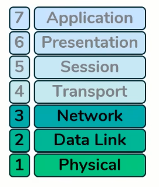

# OSI Model (Open Systems Interconnection)

The OSI model is a universal, 7-layer conceptual framework created by the ISO (International Organization for Standardization). It standardizes how different computer systems and hardware interact and communicate over a network, breaking down data transmission into distinct, abstract stages to simplify design and troubleshooting.

---

## Table of Contents
- [Layer 1: Physical Layer](#layer-1-physical-layer)
- [Layer 2: Data Link Layer](#layer-2-data-link-layer)
- [Layer 3: Network Layer](#layer-3-network-layer)
- [Layer 4: Transport Layer](#layer-4-transport-layer)
- [Layers 5-7: Session, Presentation, and Application](#layers-5-7-session-presentation-and-application)
- [Key Concepts](#key-concepts)

---

## Layer 1: Physical Layer

**Goal:** Transporting bits (ones and zeros) between devices.

**Key Characteristics:**
- Deals with the physical transmission of raw bit streams
- Defines electrical, mechanical, and procedural specifications

**Examples:**
- Physical media: cables (Ethernet, fiber optic), wireless technology (Wi-Fi, radio waves)
- Devices: repeaters and hubs (Layer 1 technologies that extend or carry signals)

---

## Layer 2: Data Link Layer

**Goal:** "Hop-to-hop" delivery — moving data between specific network interfaces on the same local network.

**Key Characteristics:**
- **Addressing:** Uses MAC addresses (48-bit unique identifiers for network interface cards)
- Provides error detection from physical layer
- Handles frame synchronization

**Devices:**
- Switches and NICs (Layer 2 technologies that assist in data delivery across a single hop)

---

## Layer 3: Network Layer

**Goal:** "End-to-end" delivery — ensuring data reaches the target destination from the source, potentially across multiple networks.

**Key Characteristics:**
- **Addressing:** Uses IP addresses (32-bit for IPv4) to identify specific end-hosts
- Handles routing and forwarding
- Manages fragmentation and reassembly

**Devices:**
- Routers (function at Layer 3 to facilitate end-to-end communication)

---

## Layer 4: Transport Layer

**Primary Goal:** Service-to-service delivery — ensuring data reaches the specific program (e.g., web browser, game, chat app) running on the host.

**Mechanism:**
- Uses **ports** to distinguish between multiple data streams running simultaneously on a computer
- Provides end-to-end communication services for applications

**Protocols:**
- **TCP (Transmission Control Protocol):** Prioritizes reliability
  - Connection-oriented
  - Guarantees delivery and order
  - Error checking and recovery
- **UDP (User Datagram Protocol):** Prioritizes efficiency
  - Connectionless
  - Faster but no delivery guarantees
  - Used for real-time applications (video streaming, gaming)

**Port Addressing:**
- 65,535 possible ports for both TCP and UDP
- **Server-side:** Servers listen on predefined "well-known" ports:
  - HTTP: port 80
  - HTTPS: port 443
  - IRC: port 6667
- **Client-side:** Client dynamically selects a random source port for each connection, allowing multiple tabs/programs without data stream overlap

---

## Layers 5-7: Session, Presentation, and Application

**Current State:** The formal distinctions between these layers have become somewhat vague in modern practice.

- **Layer 5 (Session):** Manages sessions/connections between applications
- **Layer 6 (Presentation):** Data translation, encryption, and compression
- **Layer 7 (Application):** Network services to applications (HTTP, FTP, SMTP)

**Modern Practice:**
Because applications are free to implement these layers as they see fit, they are often grouped together as a single **Application layer**, mirroring the simplified structure of the TCP/IP model.

---

## Key Concepts

### How Layers Work Together

Data travels by **encapsulation**:
1. The payload is wrapped in Layer 3 information (IP addresses) for the full journey
2. Layer 2 headers (MAC addresses) are constantly added and removed at each router hop to facilitate physical transit
3. Each layer adds its own header to the data before passing it down

### Address Resolution Protocol (ARP)

- **Purpose:** Links Layer 3 IP addresses to Layer 2 MAC addresses
- Essential for local network communication
- See [Host Functioning](host-functioning.md) for detailed ARP process
